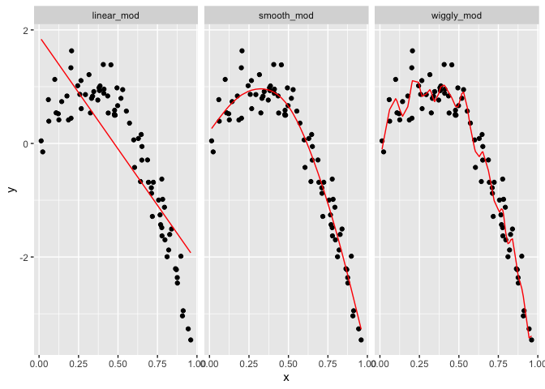

Cross Validation
================
11/12/2019

``` r
library(tidyverse)
library(modelr)
library(mgcv)

set.seed(1)
```

Lecture notes: Cross validation involves taking your dataset and
splitting it into two datasets: training and testing datasets.
“Training” = data to build your model. “Testing” = data to use to
evaluate out-of-sample fit. 80/20 ratio is a good split, but it also
depends upon your sample size.

You evaluate the two datasets using the root mean squared error (RMSE).

You will introduced randomness with your split data, so you should
iterate splits so that you can generate multiple iterations of the the
process to account for the randomness.

Cross validation - use `modelr` package for:

  - `add_predictions()` and `add_residuals()`  
  - `rmse()`  
  - `crossv_mc`

<!-- end list -->

``` r
nonlin_df = 
  tibble(
    id = 1:100,
    x = runif(100, 0, 1),
    y = 1 - 10 * (x - .3) ^ 2 + rnorm(100, 0, .3)
  )

nonlin_df %>% 
  ggplot(aes(x = x, y = y)) + 
  geom_point()
```

<!-- -->

Our goal is to fit a line that goes smoothly through the curve of
points.

``` r
train_df <- sample_n(nonlin_df, 80)
test_df <- anti_join(nonlin_df, train_df, by = "id")

ggplot(train_df, aes(x = x, y = y)) + 
  geom_point() + 
  geom_point(data = test_df, color = "red")
```

<!-- -->

``` r
linear_mod = lm(y ~ x, data = train_df)
smooth_mod = mgcv::gam(y ~ s(x), data = train_df)
wiggly_mod = mgcv::gam(y ~ s(x, k = 30), sp = 10e-6, data = train_df)
```

``` r
train_df %>% 
  add_predictions(smooth_mod) %>% 
  ggplot(aes(x = x, y = y)) + geom_point() + 
  geom_line(aes(y = pred), color = "red")
```

<!-- -->

``` r
train_df %>% 
  add_predictions(wiggly_mod) %>% 
  ggplot(aes(x = x, y = y)) + geom_point() + 
  geom_line(aes(y = pred), color = "red")
```

<!-- -->

``` r
train_df %>% 
  gather_predictions(linear_mod, smooth_mod, wiggly_mod) %>% 
  mutate(model = fct_inorder(model)) %>% 
  ggplot(aes(x = x, y = y)) + 
  geom_point() + 
  geom_line(aes(y = pred), color = "red") + 
  facet_wrap(~model)
```

<!-- -->

``` r
rmse(linear_mod, test_df)
```

    ## [1] 0.7052956

``` r
rmse(smooth_mod, test_df)
```

    ## [1] 0.2221774

``` r
rmse(wiggly_mod, test_df)
```

    ## [1] 0.289051
